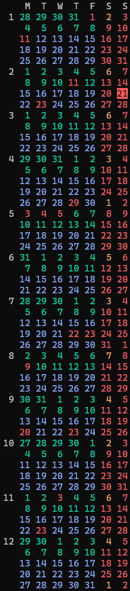

# suzuki-navi's calendar

suzuki-navi's calendar.

## Installation

    $ gem specific_install -l https://github.com/suzuki-navi/suzuki-navi-calendar.git
    $ rbenv rehash

## Usage

    $ cal

    $ cal 2021

## Development

    $ bundle install
    $ bundle exec exe/cal

## License

The gem is available as open source under the terms of the [MIT License](https://opensource.org/licenses/MIT).

